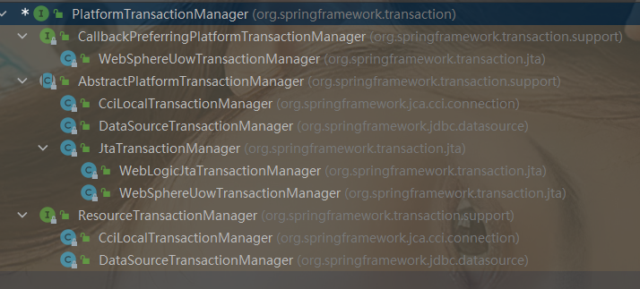

# spring事务
## spring中使用事务两种方式
1、编程式事务:硬编码的方式

2、声明式事务:注解的方式
### 1、编程式事务
编程式事务:通过硬编码的方式使用spring中提供的事务相关相关的类来控制事务 

编程式事务主要有两种用法:
#### 1、通过PlatformTransactionManager控制事务
详细步骤如下:

##### 1.定义事务管理器PlatformTransactionManager

PlatformTransactionManager多个实现的作用:
JpaTransactionManager:如果你使用jpa操作db，就要使用这个事务管理器来管理事务

DataSourceTransActionManager:如果你使用的是指定数据源的方式，比如操作数据库使用的是JdbcTemplate、mybatis、ibatis,那么就需要用这个事务管理器。

HibernateTransactionManager:如果使用的是Hibernate来操作数据库，那么就需要用这个事务管理器。

JtaTransactionManager:如果你用的是java中的jta来操作数据库，那么你就要用这个事务管理器。

##### 2.定时事务的属性TransactionDefinition

定义事务属性,比如事务的隔离级别、事务的超时时间、事务传播方式、是否是只读事务等。

spring中使用TransactionDefinition接口来表示事务的定义,比较常用的实现类,DefaultTransactionDefinition。

##### 3.开启事务

调用事务管理器的getTransaction方法,即开启一个事务。

`TransactionStatus transactionStatus = platformTransaction.getTransaction(transactionDifinition);`

这个方法会返回一个TransactionStatus表示事务状态的一个对象,通过TransactionStatus提供的一些方法可以用来控制事务的一些状态,比如事务最终是需要回滚还是需要提交。

执行了getTransaction，spring内部会执行一些操作

##### 4.执行业务代码

`JdbcTemplate jdbcTemplate = new JdbcTemplate(dataSource);`

JdbcTemplate和事务管理器用到同一个dataSource，而事务管理器管理器开启一个事务的时候，会创建一个连接，将dataSource和connection映射之后丢在一个ThreadLocal中，而JdbcTemplate内部执行db操作的时候,也需要获取连接,JdbcTemplate会以自己内部的dataSource去上面的Threadlocal中找有没有关联的连接,如果有直接拿过来用,如果没有将重新创建一个连接,而此时是可以找到的,那么JdbcTemplate就参与到spring的事务中了。
##### 5.提交or回滚
`//5.提交事务： platformTransactionManager.commit 
platformTransactionManager.commit(transactionStatus); 
//6.回滚事务：platformTransactionManager.rollback 
platformTransactionManager.rollback(transactionStatus);`
#### 2、通过TransactionTemplate控制事务
##### 1、定义事务管理器

##### 2、定义事务属性

##### 3、创建TransactionTemplate

##### 4、通过TransactionTemplate方法执行业务操作